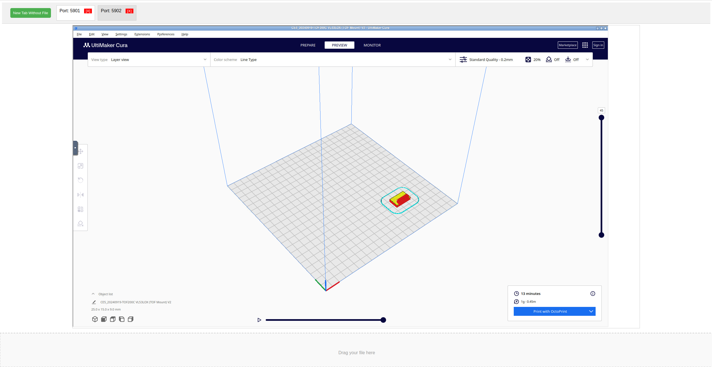

# Cura Docker Web Service
A Dockerized Python web interface that creates Cura instances, accessible via a VNC-enabled UI.

See: [LICENSE](LICENSE)

## History
I have multiple machines for which I want to slice G-code for my Ender-5, but keeping settings in sync across multiple Cura instances is a hassle.
This project was created to solve that problem.
I wanted a web-based G-code slicer, but couldn't find an existing solution, so I built this.

## Screenshots

